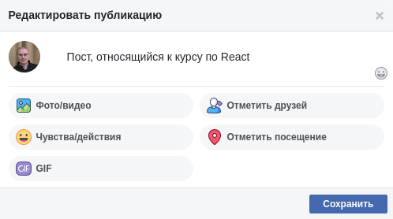

# CRUD

Реализуем CRUD при работе с HTTP с использованием Router.

## Общая механика

При нахождении на странице / отображается список существующих постов, посылается GET-запрос на адрес http://localhost:7070/posts. Полученные данные отображаются в виде карточек:

### Страница создания

Кнопка «Создать пост» ведёт на страницу добавления /posts/new. Помните про регулярные выражения.

При нажатии на кнопку «Опубликовать» пост сохраняется, после чего осуществляется редирект на главную страницу.Отправляется POST-запрос на адрес http://localhost:7070/posts с body: {"id": 0, "content": "То, что введено в поле ввода"}. При нажатии на крестик в верхнем правом углу происходит редирект на главную без сохранения.

### Страница просмотра

На странице просмотра /posts/{id} отображается карточка просмотра:

При клике на кнопку «Удалить» происходит удаление поста, после чего осуществляется редирект на главную страницу. Отправляется DELETE-запрос на адрес http://localhost:7070/posts/{id}.

При клике на кнопку «Редактировать» карточка просмотра заменяется карточкой редактирования:

-  кнопка «Сохранить» приводит к сохранению поста и отображению карточки просмотра с обновлёнными данными. Отправляется POST-запрос на адрес http://localhost:7070/posts с body: {"id": не 0, "content": "То, что введено в поле ввода"};
-  кнопка крестик приводит к возврату к карточке просмотра.
